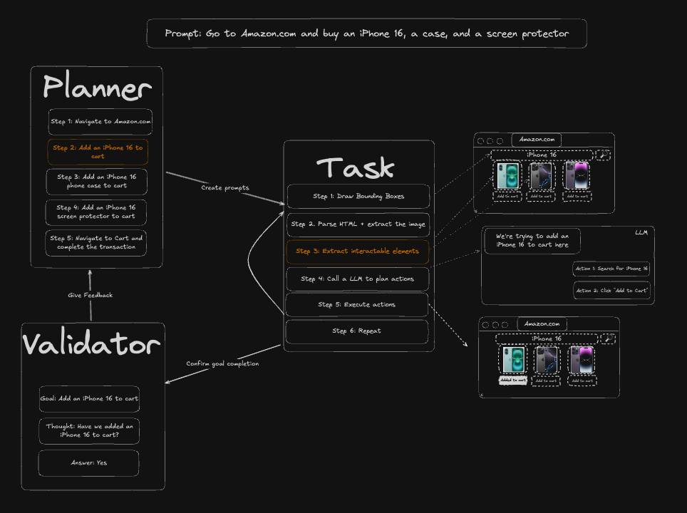
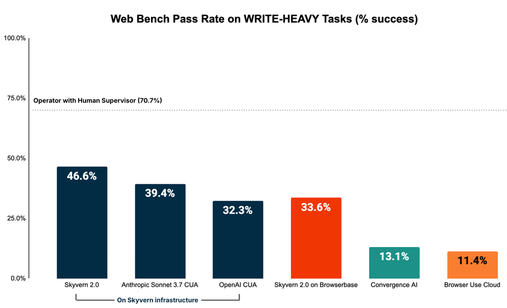
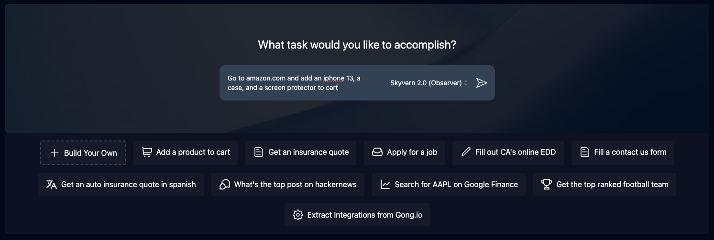
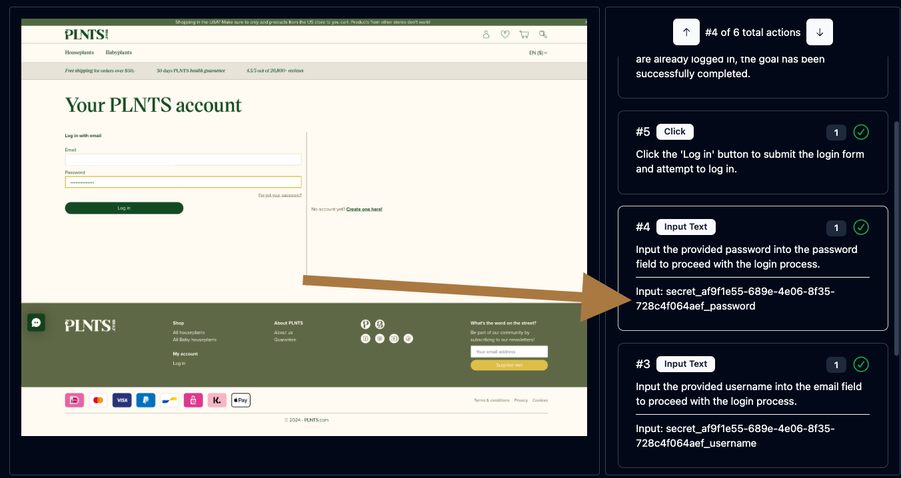
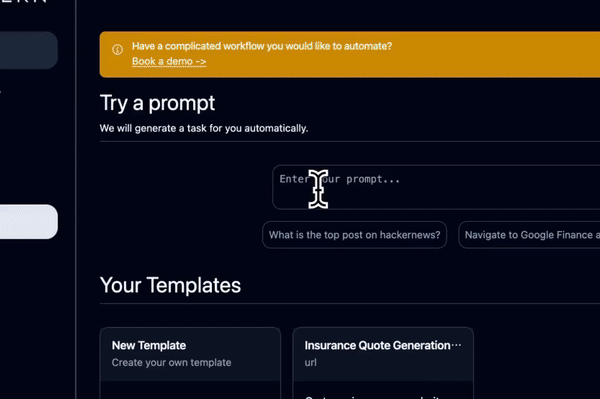
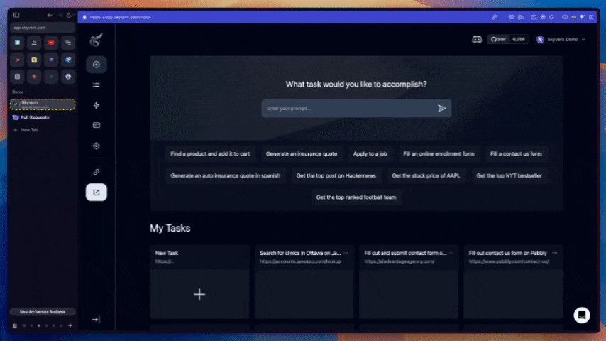

<!-- DOCTOC SKIP -->

<h1 align="center">
 <a href="https://www.skyvern.com">
  <picture>
    <source media="(prefers-color-scheme: dark)" srcset="fern/images/skyvern_logo.png"/>
    
  </picture>
 </a>
 <br />
</h1>
<p align="center">
🐉 Automate Job Applications using LLMs and Computer Vision 🐉
</p>
<p align="center">
  <a href="https://www.skyvern.com/"></a>
  <a href="https://www.skyvern.com/docs/"></a>
  <a href="https://discord.gg/fG2XXEuQX3"></a>
  <!-- <a href="https://pepy.tech/project/skyvern" target="_blank"></a> -->
  <a href="https://github.com/skyvern-ai/skyvern"></a>
  <a href="https://github.com/Skyvern-AI/skyvern/blob/main/LICENSE"></a>
  <a href="https://twitter.com/skyvernai"></a>
  <a href="https://www.linkedin.com/company/95726232"></a>
</p>

[Skyvern Jobraker](https://www.skyvern.com) automates job applications using LLMs and computer vision. It provides a simple API endpoint to fully automate job application submissions across a large number of job boards and company career sites, replacing manual job application processes.

<p align="center">
  
</p>

Traditional approaches to automating job applications required writing custom scripts for each job board, often relying on DOM parsing and XPath-based interactions which would break whenever the website layouts changed.

Instead of only relying on code-defined XPath interactions, Skyvern Jobraker relies on Vision LLMs to intelligently understand and interact with job application forms across different platforms.

# How it works
Skyvern Jobraker was inspired by the Task-Driven autonomous agent design popularized by [BabyAGI](https://github.com/yoheinakajima/babyagi) and [AutoGPT](https://github.com/Significant-Gravitas/AutoGPT) -- with one major bonus: we give Skyvern Jobraker the ability to interact with job application websites using browser automation libraries like [Playwright](https://playwright.dev/).

Skyvern Jobraker uses a swarm of agents to comprehend job application forms, and plan and execute its actions:

<picture>
  <source media="(prefers-color-scheme: dark)" srcset="fern/images/skyvern_2_0_system_diagram.png" />
  
</picture>

This approach has a few advantages:

1. Skyvern Jobraker can operate on job boards it's never seen before, as it's able to map visual elements to actions necessary to complete a job application, without any customized code
1. Skyvern Jobraker is resistant to website layout changes, as there are no pre-determined XPaths or other selectors our system is looking for while trying to navigate
1. Skyvern Jobraker is able to take a single job application workflow and apply it to a large number of job boards and company career sites, as it's able to reason through the interactions necessary to complete the application
1. Skyvern Jobraker leverages LLMs to reason through interactions to ensure we can cover complex job application scenarios. Examples include:
    1. If a job application asks "Do you have 3+ years of experience in Python?", it can infer the answer from your resume showing 5 years of Python development
    1. When asked about salary expectations, it can intelligently format and provide appropriate responses based on your profile and the job market

A detailed technical report can be found [here](https://www.skyvern.com/blog/skyvern-2-0-state-of-the-art-web-navigation-with-85-8-on-webvoyager-eval/).

# Demo
<!-- Redo demo -->
https://github.com/user-attachments/assets/5cab4668-e8e2-4982-8551-aab05ff73a7f

# Performance & Evaluation

Skyvern Jobraker has SOTA performance on the [WebBench benchmark](webbench.ai) with a 64.4% accuracy, demonstrating exceptional capability in handling job application forms across diverse platforms. The technical report + evaluation can be found [here](https://www.skyvern.com/blog/web-bench-a-new-way-to-compare-ai-browser-agents/)

<p align="center">
  
</p>

## Performance on WRITE tasks (eg filling out forms, logging in, downloading files, etc)

Skyvern Jobraker excels at WRITE tasks (eg filling out job application forms, logging in to job portals, uploading resumes, etc), which is essential for automated job application submissions.

<p align="center">
  
</p>

# Quickstart

## Skyvern Jobraker Cloud
[Skyvern Cloud](https://app.skyvern.com) is a managed cloud version of Skyvern Jobraker that allows you to run automated job applications without worrying about the infrastructure. It allows you to submit multiple job applications in parallel and comes bundled with anti-bot detection mechanisms, proxy network, and CAPTCHA solvers.

If you'd like to try it out, navigate to [app.skyvern.com](https://app.skyvern.com) and create an account.

## Install & Run

Dependencies needed:
- [Python 3.11.x](https://www.python.org/downloads/), works with 3.12, not ready yet for 3.13
- [NodeJS & NPM](https://nodejs.org/en/download/)

Additionally, for Windows:
- [Rust](https://rustup.rs/)
- VS Code with C++ dev tools and Windows SDK

### 1. Install Skyvern Jobraker

```bash
pip install skyvern
```

### 2. Run Skyvern Jobraker
This is most helpful for first time run (db setup, db migrations etc).

```bash
skyvern quickstart
```

### 3. Run task

#### UI (Recommended)

Start the Skyvern Jobraker service and UI (when DB is up and running)

```bash
skyvern run all
```

Go to http://localhost:8080 and use the UI to run a job application task

#### Code

```python
from skyvern import Skyvern

skyvern = Skyvern()
task = await skyvern.run_task(prompt="Apply to the software engineer position on this job board")
print(task)
```
Skyvern Jobraker starts running the task in a browser that pops up and closes it when the application is submitted. You will be able to view the task from http://localhost:8080/history

You can also run a task on different targets:
```python
from skyvern import Skyvern

# Run on Skyvern Jobraker Cloud
skyvern = Skyvern(api_key="SKYVERN API KEY")

# Local Skyvern Jobraker service
skyvern = Skyvern(base_url="http://localhost:8000", api_key="LOCAL SKYVERN API KEY")

task = await skyvern.run_task(prompt="Apply to the software engineer position on this job board")
print(task)
```

## Advanced Usage

### Control your own browser (Chrome)
> ⚠️ WARNING: Since [Chrome 136](https://developer.chrome.com/blog/remote-debugging-port), Chrome refuses any CDP connect to the browser using the default user_data_dir. In order to use your browser data, Skyvern Jobraker copies your default user_data_dir to `./tmp/user_data_dir` the first time connecting to your local browser. ⚠️

1. Just With Python Code
```python
from skyvern import Skyvern

# The path to your Chrome browser. This example path is for Mac.
browser_path = "/Applications/Google Chrome.app/Contents/MacOS/Google Chrome"
skyvern = Skyvern(
    base_url="http://localhost:8000",
    api_key="YOUR_API_KEY",
    browser_path=browser_path,
)
task = await skyvern.run_task(
    prompt="Apply to the software engineer position on this job board",
)
```

2. With Skyvern Jobraker Service

Add two variables to your .env file:
```bash
# The path to your Chrome browser. This example path is for Mac.
CHROME_EXECUTABLE_PATH="/Applications/Google Chrome.app/Contents/MacOS/Google Chrome"
BROWSER_TYPE=cdp-connect
```

Restart Skyvern Jobraker service `skyvern run all` and run the task through UI or code

### Run Skyvern Jobraker with any remote browser
Grab the cdp connection url and pass it to Skyvern Jobraker

```python
from skyvern import Skyvern

skyvern = Skyvern(cdp_url="your cdp connection url")
task = await skyvern.run_task(
    prompt="Apply to the software engineer position on this job board",
)
```

### Get consistent output schema from your run
You can do this by adding the `data_extraction_schema` parameter:
```python
from skyvern import Skyvern

skyvern = Skyvern()
task = await skyvern.run_task(
    prompt="Apply to the software engineer position on this job board",
    data_extraction_schema={
        "type": "object",
        "properties": {
            "job_title": {
                "type": "string",
                "description": "The title of the job you applied to"
            },
            "company_name": {
                "type": "string",
                "description": "The name of the company"
            },
            "application_id": {
                "type": "string",
                "description": "Application reference or confirmation number"
            }
        }
    }
)
```

### Helpful commands to debug issues


```bash
# Launch the Skyvern Jobraker Server Separately*
skyvern run server

# Launch the Skyvern Jobraker UI
skyvern run ui

# Check status of the Skyvern Jobraker service
skyvern status

# Stop the Skyvern Jobraker service
skyvern stop all

# Stop the Skyvern Jobraker UI
skyvern stop ui

# Stop the Skyvern Jobraker Server Separately
skyvern stop server
```

## Docker Compose setup

1. Make sure you have [Docker Desktop](https://www.docker.com/products/docker-desktop/) installed and running on your machine
1. Make sure you don't have postgres running locally (Run `docker ps` to check)
1. Clone the repository and navigate to the root directory
1. Run `skyvern init llm` to generate a `.env` file. This will be copied into the Docker image.
1. Fill in the LLM provider key on the [docker-compose.yml](./docker-compose.yml). *If you want to run Skyvern Jobraker on a remote server, make sure you set the correct server ip for the UI container in [docker-compose.yml](./docker-compose.yml).*
2. Run the following command via the commandline:
   ```bash
    docker compose up -d
   ```
3. Navigate to `http://localhost:8080` in your browser to start using the UI

> **Important:** Only one Postgres container can run on port 5432 at a time. If you switch from the CLI-managed Postgres to Docker Compose, you must first remove the original container:
> ```bash
> docker rm -f postgresql-container
> ```

If you encounter any database related errors while using Docker to run Skyvern Jobraker, check which Postgres container is running with `docker ps`.


# Skyvern Jobraker Features

## Skyvern Jobraker Tasks
Tasks are the fundamental building block inside Skyvern Jobraker. Each task is a single request to Skyvern Jobraker, instructing it to navigate through a job board or career site and accomplish a specific goal, such as submitting a job application.

Tasks require you to specify a `url`, `prompt`, and can optionally include a `data schema` (if you want the output to conform to a specific schema) and `error codes` (if you want Skyvern Jobraker to stop running in specific situations).

<p align="center">
  
</p>


## Skyvern Jobraker Workflows
Workflows are a way to chain multiple tasks together to form a cohesive job application process.

For example, if you wanted to apply to multiple jobs at different companies, you could create a workflow that first searches for relevant job listings, filters them based on your criteria, then iterates through each job to submit applications with your resume and cover letter customized for each position.

Another example is automating the complete job application flow: first navigating to a company's careers page, searching for positions matching your criteria, filling out the application form with your information, uploading your resume and cover letter, and finally submitting the application.

Supported workflow features include:
1. Browser Task
1. Browser Action
1. Data Extraction
1. Validation
1. For Loops
1. File parsing
1. Sending emails
1. Text Prompts
1. HTTP Request Block
1. Custom Code Block
1. Uploading files to block storage
1. (Coming soon) Conditionals

<p align="center">
  
</p>

## Livestreaming
Skyvern Jobraker allows you to livestream the viewport of the browser to your local machine so that you can see exactly what Skyvern Jobraker is doing on the job application page. This is useful for debugging and understanding how Skyvern Jobraker is interacting with job boards, and intervening when necessary

## Form Filling
Skyvern Jobraker is natively capable of filling out job application forms on websites. Passing in your information via the `navigation_goal` will allow Skyvern Jobraker to comprehend your profile and fill out the application forms accordingly.

## Data Extraction
Skyvern Jobraker is also capable of extracting data from job postings and application confirmations.

You can also specify a `data_extraction_schema` directly within the main prompt to tell Skyvern Jobraker exactly what data you'd like to extract from the job board or application confirmation page, in jsonc format. Skyvern Jobraker's output will be structured in accordance to the supplied schema.

## File Downloading
Skyvern Jobraker is also capable of downloading files from job boards (such as job descriptions, application receipts, or confirmation PDFs). All downloaded files are automatically uploaded to block storage (if configured), and you can access them via the UI.

## Authentication
Skyvern Jobraker supports a number of different authentication methods to make it easier to automate job applications behind a login. If you'd like to try it out, please reach out to us [via email](mailto:founders@skyvern.com) or [discord](https://discord.gg/fG2XXEuQX3).

<p align="center">
  
</p>


### 🔐 2FA Support (TOTP)
Skyvern Jobraker supports a number of different 2FA methods to allow you to automate job application workflows that require 2FA.

Examples include:
1. QR-based 2FA (e.g. Google Authenticator, Authy)
1. Email based 2FA
1. SMS based 2FA

🔐 Learn more about 2FA support [here](https://www.skyvern.com/docs/credentials/totp).

### Password Manager Integrations
Skyvern Jobraker currently supports the following password manager integrations:
- [x] Bitwarden
- [ ] 1Password
- [ ] LastPass


## Model Context Protocol (MCP)
Skyvern Jobraker supports the Model Context Protocol (MCP) to allow you to use any LLM that supports MCP.

See the MCP documentation [here](https://github.com/Skyvern-AI/skyvern/blob/main/integrations/mcp/README.md)

## Zapier / Make.com / N8N Integration
Skyvern Jobraker supports Zapier, Make.com, and N8N to allow you to connect your job application workflows to other apps.

* [Zapier](https://www.skyvern.com/docs/integrations/zapier)
* [Make.com](https://www.skyvern.com/docs/integrations/make.com)
* [N8N](https://www.skyvern.com/docs/integrations/n8n)

🔐 Learn more about 2FA support [here](https://www.skyvern.com/docs/credentials/totp).


# Real-world examples of Skyvern Jobraker
We love to see how Skyvern Jobraker is being used to automate job applications in the wild. Here are some examples of how Skyvern Jobraker is being used to streamline the job application process. Please open PRs to add your own examples!

## Automate the job application process (Primary Use Case)
[💡 See it in action](https://app.skyvern.com/tasks/create/job_application)
<p align="center">
  
</p>

Skyvern Jobraker excels at automating job applications across multiple platforms, filling out application forms, uploading resumes, and submitting applications automatically.

## Additional Automation Capabilities

While Skyvern Jobraker is optimized for job applications, it can also handle related tasks:

### Invoice Downloading on many different websites
[Book a demo to see it live](https://meetings.hubspot.com/skyvern/demo)

<p align="center">
  
</p>

### Automate materials procurement for a manufacturing company
[💡 See it in action](https://app.skyvern.com/tasks/create/finditparts)
<p align="center">
  
</p>

### Navigating to government websites to register accounts or fill out forms
[💡 See it in action](https://app.skyvern.com/tasks/create/california_edd)
<p align="center">
  
</p>
<!-- Add example of delaware entity lookups x2 -->

### Filling out random contact us forms
[💡 See it in action](https://app.skyvern.com/tasks/create/contact_us_forms)
<p align="center">
  
</p>


### Retrieving insurance quotes from insurance providers in any language
[💡 See it in action](https://app.skyvern.com/tasks/create/bci_seguros)
<p align="center">
  
</p>

[💡 See it in action](https://app.skyvern.com/tasks/create/geico)

<p align="center">
  
</p>

# Contributor Setup
Make sure to have [uv](https://docs.astral.sh/uv/getting-started/installation/) installed.
1. Run this to create your virtual environment (`.venv`)
    ```bash
    uv sync --group dev
    ```
2. Perform initial server configuration
    ```bash
    uv run skyvern quickstart
    ```
3. Navigate to `http://localhost:8080` in your browser to start using the UI
   *The Skyvern Jobraker CLI supports Windows, WSL, macOS, and Linux environments.*

# Documentation

More extensive documentation can be found on our [📕 docs page](https://www.skyvern.com/docs). Please let us know if something is unclear or missing by opening an issue or reaching out to us [via email](mailto:founders@skyvern.com) or [discord](https://discord.gg/fG2XXEuQX3).

# Supported LLMs
| Provider | Supported Models |
| -------- | ------- |
| OpenAI   | gpt4-turbo, gpt-4o, gpt-4o-mini |
| Anthropic | Claude 3 (Haiku, Sonnet, Opus), Claude 3.5 (Sonnet) |
| Azure OpenAI | Any GPT models. Better performance with a multimodal llm (azure/gpt4-o) |
| AWS Bedrock | Anthropic Claude 3 (Haiku, Sonnet, Opus), Claude 3.5 (Sonnet) |
| Gemini | Gemini 2.5 Pro and flash, Gemini 2.0 |
| Ollama | Run any locally hosted model via [Ollama](https://github.com/ollama/ollama) |
| OpenRouter | Access models through [OpenRouter](https://openrouter.ai) |
| OpenAI-compatible | Any custom API endpoint that follows OpenAI's API format (via [liteLLM](https://docs.litellm.ai/docs/providers/openai_compatible)) |

#### Environment Variables

##### OpenAI
| Variable | Description| Type | Sample Value|
| -------- | ------- | ------- | ------- |
| `ENABLE_OPENAI`| Register OpenAI models | Boolean | `true`, `false` |
| `OPENAI_API_KEY` | OpenAI API Key | String | `sk-1234567890` |
| `OPENAI_API_BASE` | OpenAI API Base, optional | String | `https://openai.api.base` |
| `OPENAI_ORGANIZATION` | OpenAI Organization ID, optional | String | `your-org-id` |

Recommended `LLM_KEY`: `OPENAI_GPT4O`, `OPENAI_GPT4O_MINI`, `OPENAI_GPT4_1`, `OPENAI_O4_MINI`, `OPENAI_O3`

##### Anthropic
| Variable | Description| Type | Sample Value|
| -------- | ------- | ------- | ------- |
| `ENABLE_ANTHROPIC` | Register Anthropic models| Boolean | `true`, `false` |
| `ANTHROPIC_API_KEY` | Anthropic API key| String | `sk-1234567890` |

Recommended`LLM_KEY`: `ANTHROPIC_CLAUDE3.5_SONNET`, `ANTHROPIC_CLAUDE3.7_SONNET`, `ANTHROPIC_CLAUDE4_OPUS`, `ANTHROPIC_CLAUDE4_SONNET`

##### Azure OpenAI
| Variable | Description| Type | Sample Value|
| -------- | ------- | ------- | ------- |
| `ENABLE_AZURE` | Register Azure OpenAI models | Boolean | `true`, `false` |
| `AZURE_API_KEY` | Azure deployment API key | String | `sk-1234567890` |
| `AZURE_DEPLOYMENT` | Azure OpenAI Deployment Name | String | `skyvern-deployment`|
| `AZURE_API_BASE` | Azure deployment api base url| String | `https://skyvern-deployment.openai.azure.com/`|
| `AZURE_API_VERSION` | Azure API Version| String | `2024-02-01`|

Recommended `LLM_KEY`: `AZURE_OPENAI`

##### AWS Bedrock
| Variable | Description| Type | Sample Value|
| -------- | ------- | ------- | ------- |
| `ENABLE_BEDROCK` | Register AWS Bedrock models. To use AWS Bedrock, you need to make sure your [AWS configurations](https://github.com/boto/boto3?tab=readme-ov-file#using-boto3) are set up correctly first. | Boolean | `true`, `false` |

Recommended `LLM_KEY`: `BEDROCK_ANTHROPIC_CLAUDE3.7_SONNET_INFERENCE_PROFILE`, `BEDROCK_ANTHROPIC_CLAUDE4_OPUS_INFERENCE_PROFILE`, `BEDROCK_ANTHROPIC_CLAUDE4_SONNET_INFERENCE_PROFILE`

##### Gemini
| Variable | Description| Type | Sample Value|
| -------- | ------- | ------- | ------- |
| `ENABLE_GEMINI` | Register Gemini models| Boolean | `true`, `false` |
| `GEMINI_API_KEY` | Gemini API Key| String | `your_google_gemini_api_key`|

Recommended `LLM_KEY`: `GEMINI_2.5_PRO_PREVIEW`, `GEMINI_2.5_FLASH_PREVIEW`

##### Ollama
| Variable | Description| Type | Sample Value|
| -------- | ------- | ------- | ------- |
| `ENABLE_OLLAMA`| Register local models via Ollama | Boolean | `true`, `false` |
| `OLLAMA_SERVER_URL` | URL for your Ollama server | String | `http://host.docker.internal:11434` |
| `OLLAMA_MODEL` | Ollama model name to load | String | `qwen2.5:7b-instruct` |

Recommended `LLM_KEY`: `OLLAMA`

Note: Ollama does not support vision yet.

##### OpenRouter
| Variable | Description| Type | Sample Value|
| -------- | ------- | ------- | ------- |
| `ENABLE_OPENROUTER`| Register OpenRouter models | Boolean | `true`, `false` |
| `OPENROUTER_API_KEY` | OpenRouter API key | String | `sk-1234567890` |
| `OPENROUTER_MODEL` | OpenRouter model name | String | `mistralai/mistral-small-3.1-24b-instruct` |
| `OPENROUTER_API_BASE` | OpenRouter API base URL | String | `https://api.openrouter.ai/v1` |

Recommended `LLM_KEY`: `OPENROUTER`

##### OpenAI-Compatible
| Variable | Description| Type | Sample Value|
| -------- | ------- | ------- | ------- |
| `ENABLE_OPENAI_COMPATIBLE`| Register a custom OpenAI-compatible API endpoint | Boolean | `true`, `false` |
| `OPENAI_COMPATIBLE_MODEL_NAME` | Model name for OpenAI-compatible endpoint | String | `yi-34b`, `gpt-3.5-turbo`, `mistral-large`, etc.|
| `OPENAI_COMPATIBLE_API_KEY` | API key for OpenAI-compatible endpoint | String | `sk-1234567890`|
| `OPENAI_COMPATIBLE_API_BASE` | Base URL for OpenAI-compatible endpoint | String | `https://api.together.xyz/v1`, `http://localhost:8000/v1`, etc.|
| `OPENAI_COMPATIBLE_API_VERSION` | API version for OpenAI-compatible endpoint, optional| String | `2023-05-15`|
| `OPENAI_COMPATIBLE_MAX_TOKENS` | Maximum tokens for completion, optional| Integer | `4096`, `8192`, etc.|
| `OPENAI_COMPATIBLE_TEMPERATURE` | Temperature setting, optional| Float | `0.0`, `0.5`, `0.7`, etc.|
| `OPENAI_COMPATIBLE_SUPPORTS_VISION` | Whether model supports vision, optional| Boolean | `true`, `false`|

Supported LLM Key: `OPENAI_COMPATIBLE`

##### General LLM Configuration
| Variable | Description| Type | Sample Value|
| -------- | ------- | ------- | ------- |
| `LLM_KEY` | The name of the model you want to use | String | See supported LLM keys above |
| `SECONDARY_LLM_KEY` | The name of the model for mini agents skyvern runs with | String | See supported LLM keys above |
| `LLM_CONFIG_MAX_TOKENS` | Override the max tokens used by the LLM | Integer | `128000` |

# Feature Roadmap
This is our planned roadmap for the next few months. If you have any suggestions or would like to see a feature added, please don't hesitate to reach out to us [via email](mailto:founders@skyvern.com) or [discord](https://discord.gg/fG2XXEuQX3).

- [x] **Open Source** - Open Source Skyvern Jobraker's core codebase
- [x] **Workflow support** - Allow support to chain multiple job application submissions together
- [x] **Improved context** - Improve Skyvern Jobraker's ability to understand content around interactable elements in job application forms
- [x] **Cost Savings** - Improve Skyvern Jobraker's stability and reduce the cost of running automated job applications
- [x] **Self-serve UI** - Deprecate the Streamlit UI in favour of a React-based UI component that allows users to kick off new job applications
- [x] **Workflow UI Builder** - Introduce a UI to allow users to build and analyze job application workflows visually
- [x] **Chrome Viewport streaming** - Introduce a way to live-stream the Chrome viewport to the user's browser during job applications
- [x] **Past Runs UI** - Deprecate the Streamlit UI in favour of a React-based UI that allows you to visualize past job application submissions and their results
- [X] **Auto workflow builder ("Observer") mode** - Allow Skyvern Jobraker to auto-generate job application workflows as it's navigating job boards
- [x] **Prompt Caching** - Introduce a caching layer to the LLM calls to dramatically reduce the cost of running job applications
- [x] **Web Evaluation Dataset** - Integrate Skyvern Jobraker with public benchmark tests to track the quality of our models over time
- [ ] **Improved Debug mode** - Allow Skyvern Jobraker to plan its actions and get "approval" before submitting job applications
- [ ] **Chrome Extension** - Allow users to interact with Skyvern Jobraker through a Chrome extension for easier job application management
- [ ] **Skyvern Jobraker Action Recorder** - Allow Skyvern Jobraker to watch a user complete a job application and then automatically generate a workflow for it
- [ ] **Interactable Livestream** - Allow users to interact with the livestream in real-time to intervene when necessary during job application submissions
- [ ] **Integrate LLM Observability tools** - Integrate LLM Observability tools to allow back-testing prompt changes with specific job application data sets
- [x] **Langchain Integration** - Create langchain integration in langchain_community to use Skyvern Jobraker as a "tool".

# Contributing

We welcome PRs and suggestions! Don't hesitate to open a PR/issue or to reach out to us [via email](mailto:founders@skyvern.com) or [discord](https://discord.gg/fG2XXEuQX3).
Please have a look at our [contribution guide](CONTRIBUTING.md) and
["Help Wanted" issues](https://github.com/skyvern-ai/skyvern/issues?q=is%3Aopen+is%3Aissue+label%3A%22help+wanted%22) to get started!

If you want to chat with the Skyvern Jobraker repository to get a high level overview of how it is structured, how to build off it, and how to resolve usage questions, check out [Code Sage](https://sage.storia.ai?utm_source=github&utm_medium=referral&utm_campaign=skyvern-readme).

# Telemetry

By Default, Skyvern Jobraker collects basic usage statistics to help us understand how Skyvern Jobraker is being used. If you would like to opt-out of telemetry, please set the `SKYVERN_TELEMETRY` environment variable to `false`.

# License
Skyvern Jobraker's open source repository is supported via a managed cloud. All of the core logic powering Skyvern Jobraker is available in this open source repository licensed under the [AGPL-3.0 License](LICENSE), with the exception of anti-bot measures available in our managed cloud offering.

If you have any questions or concerns around licensing, please [contact us](mailto:support@skyvern.com) and we would be happy to help.

# Star History

[](https://star-history.com/#Skyvern-AI/skyvern&Date)
